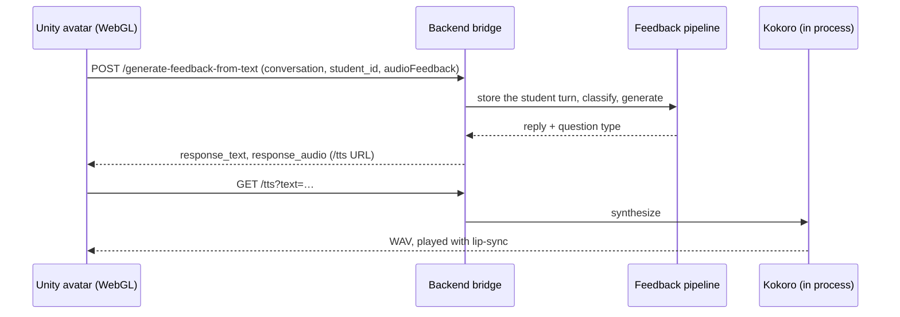

# Unity Avatar

`unity/` is an embodied 3D tutor: an animated character with a VEX-themed chat window,
lip-synced speech (uLipSync), and beat gestures while it talks. It runs in the browser as
a Unity WebGL build and gets every reply from this backend, so it gives the same grounded
feedback as the React chat.



## Speech

Speech is Kokoro-82M running inside the backend on the CPU through ONNX Runtime
(`services/tts.py`). No GPU, service, or API key is involved, and student text never
leaves the server. Fetch the model once (about 350MB into `server/models/`, the Docker
image does this itself):

```bash
python server/scripts/fetch_kokoro.py
```

The model loads and warms up in the background at startup. On an 8-core CPU a full
40-word reply takes about 3 seconds, a typical 20-word one about 1.5. Use the full
precision model: the int8 one was about 6x slower on CPUs without VNNI.

## Building The WebGL Player

Open `unity/` with Unity **2022.3.40f1**, or build headlessly:

```bash
Unity -batchmode -nographics -quit -projectPath unity -buildTarget WebGL \
      -executeMethod BuildScript.BuildWebGL -logFile -
```

The build lands in `unity/Builds/WebGL/` (git-ignored, Brotli with decompression
fallback). Install it where `webgl/index.html` loads it with
`webgl/install_build.sh unity/Builds/WebGL`.

## On The Site

Once a build is deployed (below), a signed-in student on the main page sees the avatar
in the corner over VEXcode VR instead of the text chat panel (`client/src/AvatarAgent.jsx`
frames `/webgl/?embed=1`). Its own chat window talks to the bridge, and the page relays
the proactive check-ins from the push stream so the avatar shows and speaks those too
(`ChatLLM.ReceiveProactiveJson`). A **Research view** button switches to the text panel,
which researchers need for the telemetry and the Agent tab. Until a build exists, the
page detects that and students keep the text chat, so deploying the client never breaks
the site.

## Deploying A Build

Build on any machine with Unity (above, or **File > Build Settings > WebGL** under any
name; uncompressed, or compressed with Decompression Fallback on). Copy the build folder
to the server and install it where the page loads it. The script normalizes the build's
file names, writes `build.json` with a content version, and swaps it in atomically. The
page loads every build file as `?v=<version>` and nginx serves `/webgl/` as `no-cache`,
so neither Cloudflare nor a browser can serve a stale or half-updated build. No restart
is needed; the page picks it up on the next load:

```bash
rsync -av path/to/YourBuild/ SERVER:~/avatar-build/
ssh SERVER /var/www/vex-pedagogical-agent/webgl/install_build.sh ~/avatar-build
```

## Running It Locally

```bash
python3 -m http.server 8080      # from the repo root
# open http://localhost:8080/webgl/?student_id=SOME_ID&serverurl=http://127.0.0.1:8001&audio=true
```

The page injects `serverurl`, `student_id`, and `audioFeedback` into the scene through
`ReceiveConfigJson` on the `EventSystem` object. The serving origin must be listed in
`BACKEND_CORS_ORIGINS`. For a self-contained local database with fixture students, see
`server/scripts/mvp_db.sh` and [webgl/README.md](https://github.com/InviteInstitute/vex-pedagogical-agent/blob/main/webgl/README.md).

## Security

The bridge routes sit outside `/v1`, so the Turnstile gate does not cover them. Budgets
are kept per student there, and the daily ceiling still applies, but a student id is
claimed rather than proven. Put the routes behind a gateway or auth before exposing them
publicly. See the [API reference](../reference/api.md#unity-avatar-bridge).
